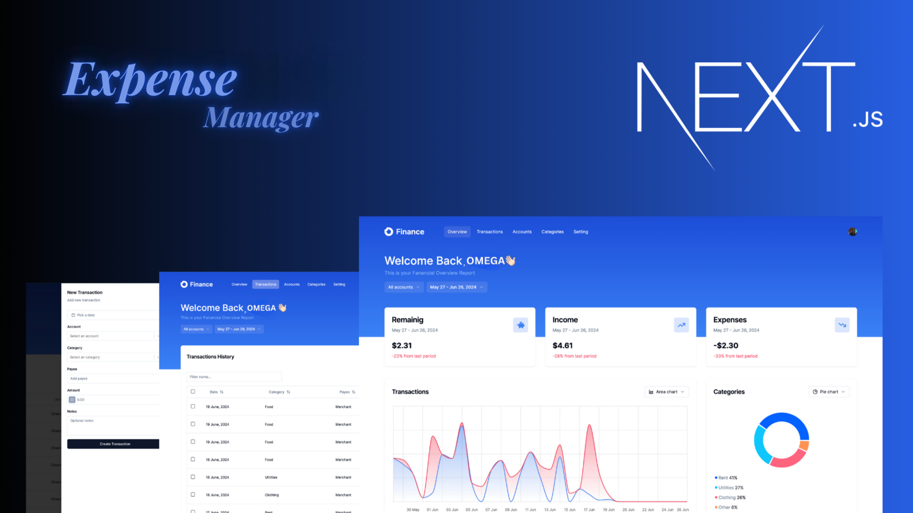
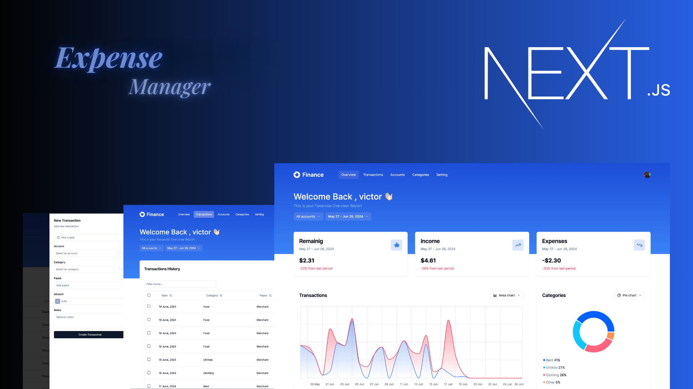
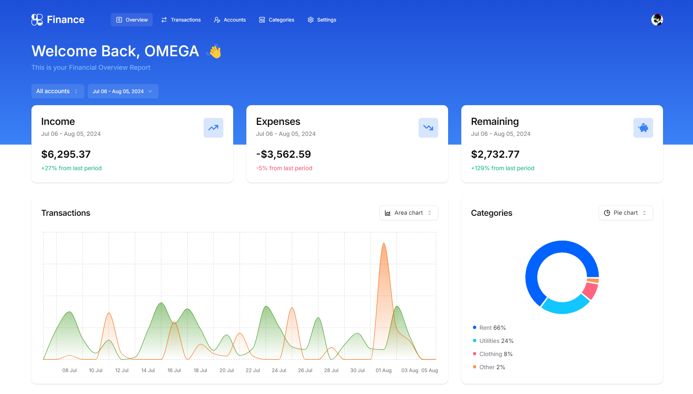
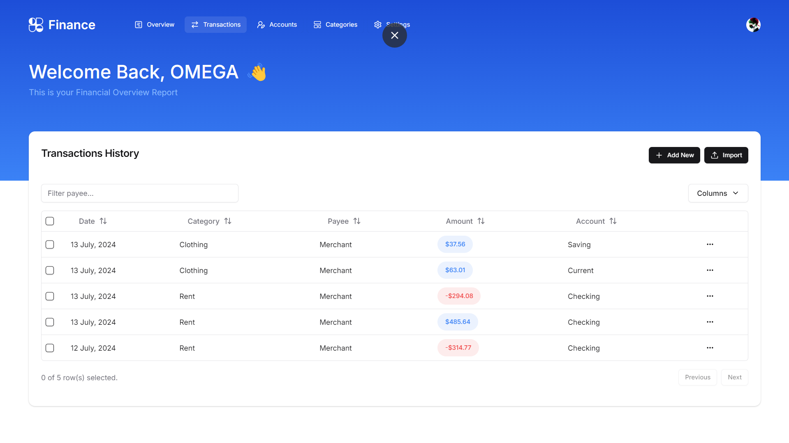
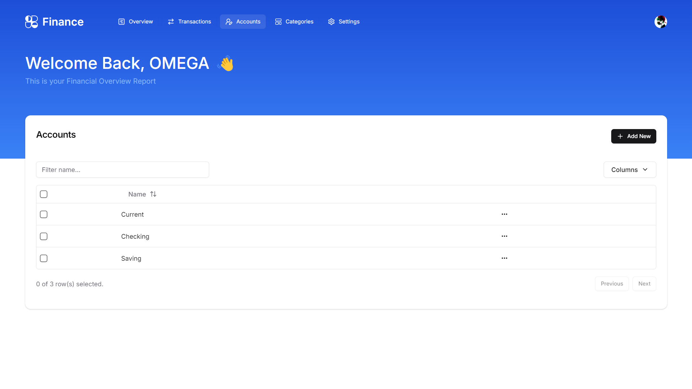
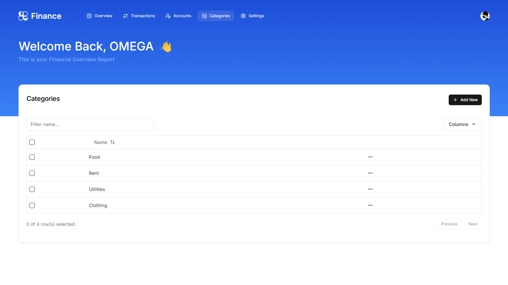

<div align="center">
 

  <h2 style="font-family: 'Georgia', serif; font-weight: bold; font-size: 2rem; color: #FFE5CA;" align="center">Expense Manager</h2>

   **<div align="center">
    <i>A comprehensive platform to track, manage, and optimize your finances.</i>
    </div>**
</div>


## 📚 Table of Contents

1. 🤖 [Introduction](#-introduction)
1. ✨ [Features](#-features)
2. 🧑‍💻 [Tech Stack](#-tech-stack)
3. 🔧 [Local Setup](#-local-setup)
7. 📄 [Feedback](#-feedback)
8. 📸 [Screenshots](#-screenshots)

<!-- 4. [📝 Contributing](#-contributing) -->
<!-- 5. [📄 License](#-license) -->
<!-- 6. [📬 Contact](#-contact) -->

## 🤖 Introduction

Expense Manager is an innovative Finance SaaS Platform designed to help users efficiently manage their personal finances. With a focus on user-friendly experience and comprehensive financial oversight, this application empowers users to track their income and expenses, visualize their financial data, and make informed financial decisions. Whether you're managing everyday expenses or analyzing complex financial data, Expense Manager provides intuitive tools and features to streamline and enhance your financial management.


## ✨ Features

- **📊 Interactive Financial Dashboard**: Visualize your financial data with dynamic charts and graphs.
- **🔁 Changeable Chart Types**: Switch between different chart types for better insights.
- **🗓 Account and Date Filters**: Filter transactions by account and date range.
- **💹 Detailed Transactions Table**: View and manage all your transactions in a comprehensive table.
- **➕ Form to Add Transactions**: Easily add new transactions through a user-friendly form.
- **🧩 Customizable Select Components**: Tailor your selection options to fit your needs.
- **💵 Income and Expense Toggle**: Switch between viewing income and expenses.
- **🔄 CSV Transaction Imports**: Import transactions via CSV files for quick data entry.
- **🔗 Bank Account Connections with Plaid**: Connect to your bank accounts securely using Plaid.
- **💳 Premium Upgrades via Lemon Squeezy**: Monetize your product with premium features.
- **🔐 Authentication via Clerk (Core 2)**: Secure authentication with Clerk.
- **🗑️ Bulk Delete and Search in Transactions**: Manage transactions with bulk delete and search functionality.
- **🏦 Bank Disconnection and Subscription Management**: Easily manage bank connections and subscriptions.
- **👤 User Settings Customization**: Personalize user settings for a better experience.
- **🌐 Built with Next.js 14**: Utilizing the latest features of Next.js.
- **🎨 Styled with TailwindCSS and Shadcn UI**: Modern and responsive styling.
- **🚀 Deployed on Vercel**: Fast and scalable deployment on Vercel.


## 🧑‍💻 Tech Stack

- ⚛️ [React](https://reactjs.org/): UI library for building user interfaces.
- ⬜ [Next.js](https://nextjs.org/): React framework for server-side rendering and static site generation.
- 💨 [Tailwind CSS](https://tailwindcss.com/): Utility-first CSS framework for rapid UI development.
- 💎 [Shadcn UI](https://shadcn.dev/): UI components for React with a focus on accessibility.
- <span style="background-color:#1e90ff;color:white;padding:1px 3px;border-radius:3px;font-size:0.7em;margin-left:3px;">TS</span> [TypeScript](https://www.typescriptlang.org/): Superset of JavaScript adding static types.

- 🔥 [Hono.js](https://honojs.dev/): High-performance web framework for building APIs.
- 🛠️ [Zod](https://zod.dev/): Schema validation for TypeScript and JavaScript.
- 🐻 [Zustand](https://zustand-demo.pmnd.rs/): Lightweight state management for React.
- 🟪 [Prisma](https://www.prisma.io/): ORM for TypeScript and Node.js with a focus on type safety.
- 🔐 [Clerk](https://clerk.dev/): Authentication and user management.

- 🌐 [Neon Database](https://neon.tech/): Serverless PostgreSQL database.
- 🐘 [PostgreSQL](https://www.postgresql.org/): Open-source relational database system.

- 🎣 [Tanstack React Query](https://react-query.tanstack.com/): Data fetching and synchronization for React.

- 💳 [Lemon Squeezy](https://www.lemonsqueezy.com/): Payment processing and subscription management.

- 🔗 [Plaid](https://plaid.com/): Connects applications to bank accounts for financial data.
  
- 🚀 [Vercel](https://vercel.com/): Platform for frontend deployment and serverless functions.


## ⚙️ Local setup

1. Clone this repository:
    ```bash
    git clone https://github.com/Vinod-Mane3021/expense-manager.git
    ```

2. Configuring the `.env` File

    - First, create a new `.env.local` file in the root directory of your project by copying the example file:
    ```bash
    cp .env.local.example .env.local
    ```

   - Open the `.env.local` file in your code editor and update the following environment variables:
   ```bash
    # auth
    NEXT_PUBLIC_CLERK_PUBLISHABLE_KEY=your_clerk_publishable_key
    CLERK_PUBLISHABLE_KEY=your_clerk_publishable_key
    CLERK_SECRET_KEY=your_clerk_secret_key

    # redirect path
    NEXT_PUBLIC_CLERK_SIGN_IN_URL=/sign-in
    NEXT_PUBLIC_CLERK_SIGN_UP_URL=/sign-up

    # postgres database
    DATABASE_URL=your_postgres_database_url

    NEXT_PUBLIC_APP_URL=http://localhost:3000
   ```
    - Replace the placeholders with your actual values:
        
        `your_clerk_publishable_key`: Obtain this key from your Clerk dashboard.

        `your_clerk_secret_key`: Obtain this key from your Clerk dashboard.

        `your_postgres_database_url`: Your PostgreSQL database connection string.

    - After updating the values, save the `.env.local` file.


2. Install dependencies:
    ```bash
    pnpm install
    ```

4. Start the development server:
    ```bash
    pnpm run dev
    ```


<!-- 

## 📝 Contributing

If you’d like to contribute to this project, please fork the repository and submit a pull request with your changes. For more details, see the [CONTRIBUTING.md](CONTRIBUTING.md) file.

## 📄 License

This project is licensed under the MIT License. See the [LICENSE](LICENSE) file for details. -->

## ****📄 Feedback****

I'd be happy to connect with you! <br>

<a href="https://www.linkedin.com/in/vinod-mane-a74817220/" target="_blank">
  
</a> 
<a href="https://x.com/VinodMane21" target="_blank">
  
</a>


## 📸 Screenshots
<!-- -  -->
- 

- 

- 

- 


